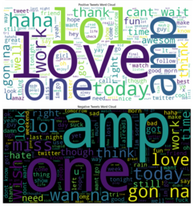
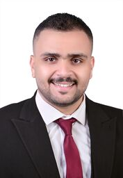
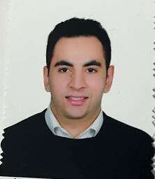

# **Customer Sentiment and Trend Analysis**


### 🚀 **Overview**
This project aims to classify sentiment (positive, negative, or neutral) from customer feedback in both English and Arabic using state-of-the-art Natural Language Processing (NLP) techniques. We explore various traditional and deep learning models to uncover sentiment trends, helping businesses better understand customer behavior and preferences.

💡 **Key Objectives**:
- Perform sentiment classification using diverse datasets.
- Apply machine learning and deep learning models, including **LSTM** and **DistilBERT**.
- Visualize sentiment trends over time and across different regions or products.

---

## 📊 **Datasets Used**

We utilized well-known datasets for sentiment analysis to ensure comprehensive model training and evaluation:

1. **[Sentiment140 Dataset](https://www.kaggle.com/datasets/kazanova/sentiment140)**: 1.6M tweets labeled with sentiment.
2. **[Amazon Product Reviews](https://www.kaggle.com/datasets/kritanjalijain/amazon-reviews/data)**: Amazon product reviews with sentiment labels.
3. **[IMDB Movie Reviews](https://www.kaggle.com/datasets/lakshmi25npathi/imdb-dataset-of-50k-movie-reviews)**: 50k movie reviews labeled as positive or negative.
4. **[Arabic Sentiment Analysis](https://www.kaggle.com/code/rehab8reda/arabic-sentiment-analysis)**: Arabic tweets with sentiment categories.

---

## 🔧 **Key Features**

### 🧹 **Data Preprocessing**
We ensure the data is well-prepared for modeling through:
- **Text Cleaning**: Removing noise (URLs, stop words, punctuation).
- **Normalization**: Tokenization, stemming, and lemmatization in both English and Arabic.
- **Feature Extraction**: Using **TF-IDF**, **CountVectorizer**, and **GloVe embeddings** to convert text into numerical form.
  
| Preprocessing Workflow 1 | Preprocessing Workflow 2 |
| ------------------------ | ------------------------ |
|  |  |

### 🧠 **Modeling**
We experimented with multiple models to achieve the best results:
- **Traditional Models**: Logistic Regression, Random Forest, SVM.
- **Deep Learning Models**: 
   - **LSTM (Long Short-Term Memory)**: For handling sequential text data.
   - **DistilBERT**: A lighter, faster version of BERT for better performance in sentiment classification.
  


### 📈 **Evaluation**
Models were evaluated using:
- **Accuracy**, **Precision**, **Recall**, and **F1-Score**.
- Visualizations like **Confusion Matrix** and **Loss/Accuracy Graphs**.
  
| Confusion Matrix | Loss/Accuracy |
| ---------------- | ------------- |
|  |  |

---

## 👥 **Team Members**

Meet the amazing team behind this project:

<div style="display: flex; flex-wrap: wrap; justify-content: space-around;">
    <div style="margin: 20px; text-align: center;">
        <br/>
        <strong>Ahmed Samy Farahat</strong><br/>
        [LinkedIn](https://www.linkedin.com/in/ahmed-s-farahat-437b14222)
    </div>
    <div style="margin: 20px; text-align: center;">
        <br/>
        <strong>Mohamed Wael Khalifa</strong><br/>
        [LinkedIn](https://www.linkedin.com/in/mohamed-wael-82b4342a2)
    </div>
    <div style="margin: 20px; text-align: center;">
        <br/>
        <strong>Ahmed Awad Ata</strong><br/>
        [LinkedIn](https://www.linkedin.com/in/ahmed-awad-148079286)
    </div>
    <div style="margin: 20px; text-align: center;">
        <br/>
        <strong>Amr Maher Abdallah</strong><br/>
        [LinkedIn](https://www.linkedin.com/me?trk=p_mwlite_feed-secondary_nav)
    </div>
    <div style="margin: 20px; text-align: center;">
        <br/>
        <strong>Ahmed Emad</strong><br/>
        [LinkedIn](https://www.linkedin.com/in/ahmed-emad-702396283/)
    </div>
    <div style="margin: 20px; text-align: center;">
        <br/>
        <strong>Ahmed Abdelhamed Hussein</strong><br/>
        [LinkedIn](https://www.linkedin.com/in/ahmed-abdelhameed-589bb6237)
    </div>
</div>

---

## 🛠 **Technologies Used**
We leveraged a range of technologies and tools to build this project:

- **Python Libraries**: Pandas, Scikit-learn, TensorFlow, Keras, SpaCy, NLTK.
- **Experiment Tracking**: **MLflow** and **DAGsHub** for model tracking and version control.
- **Cloud Services**: **Azure Cloud Services** for model deployment and scalability.
  
---

## 🏫 **Institution/Training Organization**


This project was developed as part of the **[Initiative Name](https://www.depi.gov.eg/)**.

---

## 🎥 **Demo**
To showcase our project’s capabilities, watch the demo video:
[](https://www.youtube.com/watch?v=demo_link)

---

## 💻 **How to Run the Project**
1. **Clone the repository**:
    ```bash
    git clone https://github.com/your-repo-link.git
    ```
2. **Install dependencies**:
    ```bash
    pip install -r requirements.txt
    ```
3. **Run the notebooks**:
    - Open the Jupyter notebooks to run data preprocessing, model training, and evaluation steps.
  
---

## 📈 **Results**
- **Achieved**: 90% accuracy with **DistilBERT** on English datasets.
- **Future Improvements**: Integrate more languages and optimize model inference times using GPU acceleration.
